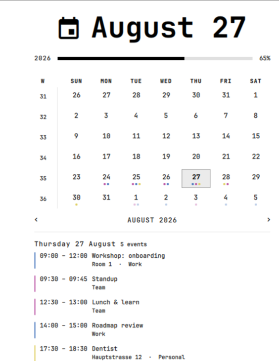
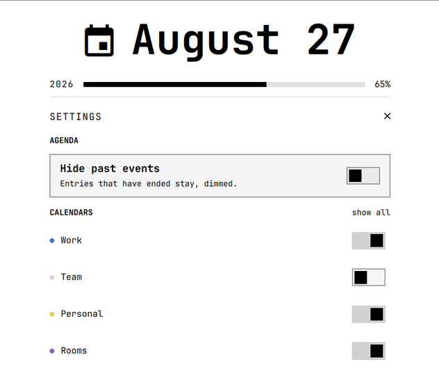

# Calendar for Omarchy

The Omarchy clock, with a calendar popup that knows what you have on.

Days carrying appointments get a dot for each calendar involved. Click a day
and its agenda appears under the grid — times, titles, locations, and which
calendar each entry came from. Click an entry and the popup opens a second
pane beside it with everything else the invitation carries; entries with a
video call get a camera icon that joins it directly. Entries that have already ended recede rather
than shout, and the gear in the agenda header opens a settings screen for
switching calendars off and deciding what happens to the past. Everything
else about the clock is unchanged: the same label formats, week numbers,
week-start toggle, year and life bars, and the same keyboard and
scroll-wheel month stepping.



Appointments come from a **pluggable exporter** that writes a documented JSON
file. A Thunderbird exporter ships with the plugin; anything else that can
write that file works too, so the plugin is not tied to Thunderbird — see
[`exporters/README.md`](exporters/README.md).

## Install

```bash
omarchy plugin add https://github.com/likt0r/omarchy-calendar --enable
omarchy plugin disable omarchy.clock   # this replaces the built-in clock
omarchy restart shell
```

Then open the popup by clicking the clock. The first open runs the exporter,
so appointments appear a moment later.

To see what it looks like before wiring up a calendar, set
`"eventSource": "demo"` on the widget's entry for a synthetic week of
appointments — that is what the screenshot above shows.

Requirements: Omarchy 4.x, Python 3.9+ (`zoneinfo`), and for the bundled
exporter a Thunderbird profile with calendars. No system packages, no root,
no network access, nothing to install into `~/.local/bin`.

## Clicking an event

Two targets in one row, so neither has to compromise:

- **The row** opens a pane beside the calendar: when it is, how often it
  repeats, where, which calendars it came from, who organised it, who
  accepted and who declined, and the invitation text — selectable, because
  that is where the dial-in number and the meeting id live. Clicking the same
  row again closes it, as does the ×.
- **The camera icon** joins the video call, handed to `xdg-open` so the
  desktop decides which application that is. The icon appears only when
  there is a link, which makes it the sign that there is one.

Recognising a join link is deliberately conservative. Real invitations are
full of URLs — attachments, dial-in pages, unsubscribe footers — so the
exporter matches known conferencing hosts and otherwise trusts only the
location field, where a join link is put on purpose. Only `http`/`https`
ever reaches the opener, checked in the exporter, in `Events.js`, and again
before the process starts. See
[`exporters/README.md`](exporters/README.md) for the rules and how to
extend the host list.

Opening the event in Thunderbird itself is not possible: it offers no
command line option for it and a single DBus method (`OpenURL`), and its
extension API does not expose selecting an event in the interface. That
would take a Thunderbird add-on, not a setting here.

## Settings

The gear at the right of the agenda header opens the settings screen:

- **Calendars** — a switch per calendar, so a shared room-booking or
  colleague's calendar can be dropped from the popup without touching
  Thunderbird. Switching one off removes it from the agenda *and* from the
  dots under the dates, and the agenda header says how many entries the
  filters are holding back rather than passing off a partial day as the whole
  one. An event shared into several calendars only disappears once all of
  them are off. "show all" clears the lot.
- **Hide past events** — off by default: an entry that has ended stays in
  the agenda, dimmed, along with the dots on days already behind you. On, it
  is left out entirely. Either way an event still running counts as current,
  not past.



Both are stored on the widget's entry in `shell.json`, so they survive
updates and can also be set by hand or with `omarchy bar set`.

Omarchy 4.x renders no settings form for plugin widgets — the manifest's
`settingsForm` and `schema` fields are carried through but not consumed — so
the screen lives inside the panel it configures.

## Configuration

Settings live on the widget's entry in `~/.config/omarchy/shell.json` and
hot-reload on save:

```json
{
  "id": "likt0r.calendar",
  "format": "dddd HH:mm",
  "eventSource": "thunderbird",
  "eventsPath": "~/.cache/omarchy-calendar/events.json",
  "hiddenCalendars": ["Room bookings"],
  "hidePastEvents": false,
  "locale": "de_DE"
}
```

| Setting | Default | Meaning |
|---|---|---|
| `eventSource` | `thunderbird` | Exporter to run, by file name under `exporters/`. `demo` for synthetic data, `none` when something else writes the file and the panel only reads. |
| `eventsPath` | `~/.cache/omarchy-calendar/events.json` | Where the events file lives. |
| `hiddenCalendars` | `[]` | Calendar names to leave out, by the name the events file gives them. A name that no longer exists is dropped on the next write. |
| `hidePastEvents` | `false` | `true` leaves finished entries out of the agenda instead of dimming them. |
| `locale` | *system* | Language for the bar label's day and month names, e.g. `de_DE`. Unset follows the system locale. |

Everything the built-in clock understands still applies — `format`,
`formatAlt`, `verticalFormat`, `weekStartDay`, `birthYear`,
`lifeExpectancy`.

### The language of the bar label

The label is a date, not interface text, so `locale` sets the language its
day and month names are rendered in — independently of the system locale,
which is often English on a machine whose owner reads dates in something
else. `format` and `locale` belong together: pick a pattern that suits the
language.

```json
{ "id": "likt0r.calendar", "locale": "de_DE", "format": "ddd dd.MM. HH:mm" }
```

| `format` | with `de_DE` |
|---|---|
| `ddd dd.MM. HH:mm` | `Do. 27.08. 14:00` |
| `ddd dd.MM HH:mm` | `Do. 27.08 14:00` |
| `ddd d.M. HH:mm` | `Do. 27.8. 14:00` |
| `dddd, d. MMMM yyyy` | `Donnerstag, 27. August 2026` |

The trailing dot on `Do.` and `Aug.` is CLDR's German abbreviation, not a
stray character; drop the pattern's own dots if the result reads too busy.

Note that this governs the bar label only. The popup's own labels stay
English, as upstream's clock intended — a localised month name in an
English word order ("August 27" rather than "27. August") would be worse
than either language done properly.

## Where the appointments come from

The panel reads one JSON file and renders it. It never talks to a calendar
server, a database, or Thunderbird. On every open it runs the configured
exporter, which rewrites that file atomically; the panel watches the path
and repaints when it changes.

That split is the point: writing an exporter for `khal`, `vdirsyncer`, an ICS
URL, or anything else means writing one program that emits the documented
shape, with no QML involved. The contract, the settings, and what the
bundled Thunderbird exporter does are all in
[`exporters/README.md`](exporters/README.md).

The Thunderbird exporter reads the calendar caches **strictly read-only**,
through a copy, so a running Thunderbird is never disturbed. It expands
recurring series itself — `RRULE` with intervals, ordinals and `BYSETPOS`,
plus `EXDATE`, `RDATE`, moved and cancelled occurrences — using only the
standard library.

Freshness is bounded by Thunderbird: its caches advance when Thunderbird
syncs. If you need appointments independent of Thunderbird running, that is
a good reason to write a second exporter.

## Development

The plugin folder is the repository, so a clone of this repo dropped into
`~/.config/omarchy/plugins/likt0r.calendar` is a working install you can edit
in place.

```bash
./tests/run-tests.sh          # exporter, Events.js, manifest, qml syntax
python3 exporters/thunderbird --print | head -40
omarchy plugin validate .
```

Two things worth knowing:

- **Hot reload covers edits, not new files.** Saving a change to an existing
  file reloads the plugin. Adding a *new* file needs
  `omarchy restart shell` before the shell sees it.
- **The exporter is where the risk lives.** Its recurrence engine is
  hand-written, so `tests/exporter-test.py` checks every recurrence case
  against independently computed dates rather than against recorded output.
  Add a case there before changing that engine.

Layout:

```
manifest.json          plugin metadata; its id decides the install folder
BarWidget.qml          bar label, hosts the popup          (from Omarchy)
Panel.qml              popup: month grid + agenda          (extended)
Model.js               date and format maths               (from Omarchy)
Events.js              lookup over the events file          (new)
exporters/thunderbird  Thunderbird -> events.json           (new)
exporters/demo         synthetic data, and the preview      (new)
exporters/README.md    the JSON contract                    (new)
tests/                 run-tests.sh + one file per unit
```

## License

MIT — see [`LICENSE`](LICENSE).

This plugin is a derivative of Omarchy's built-in clock plugin; `BarWidget.qml`,
`Model.js` and parts of `Panel.qml` originate there. See [`NOTICE`](NOTICE) for
the attribution.
